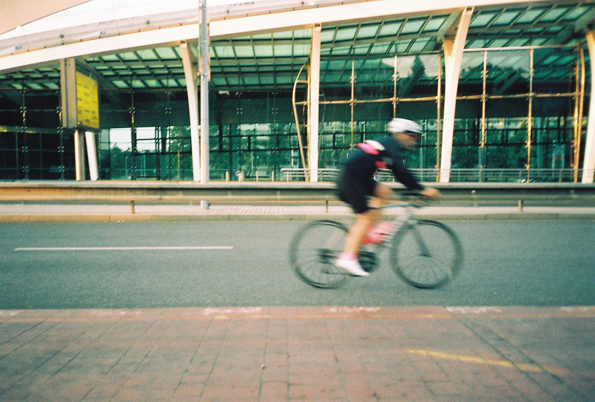
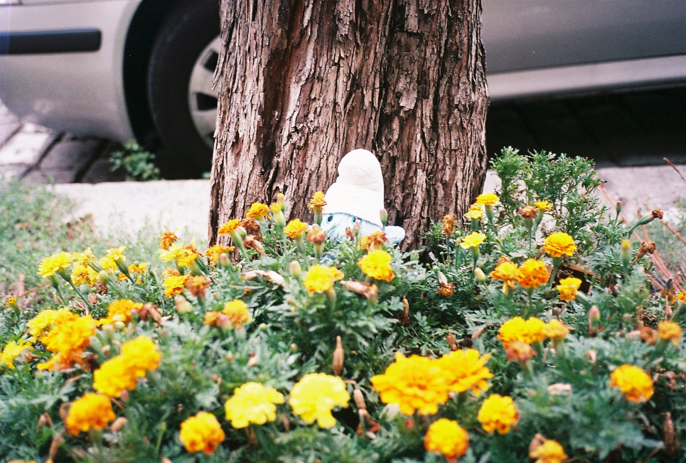
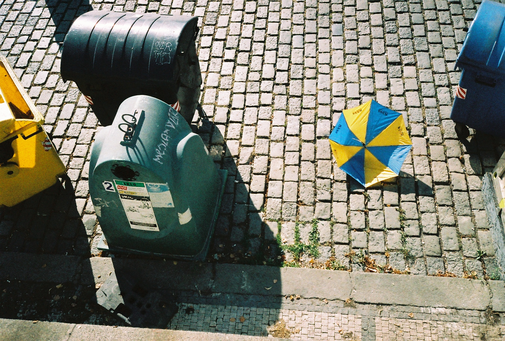
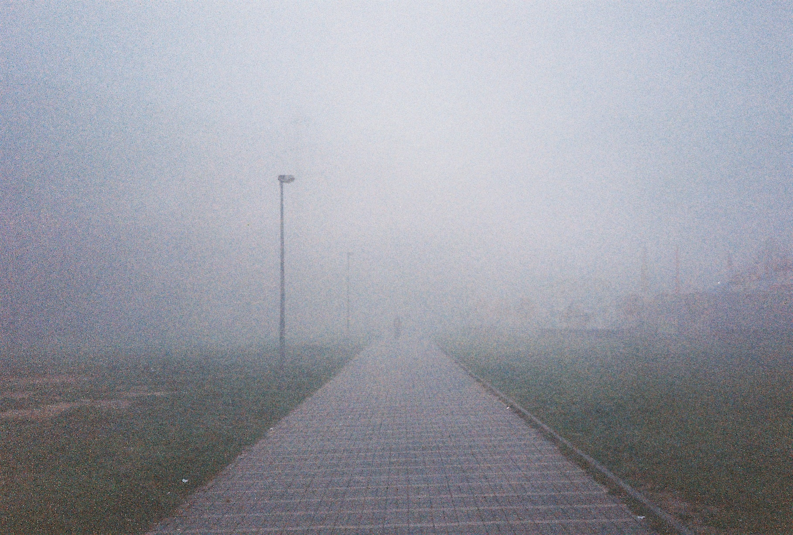
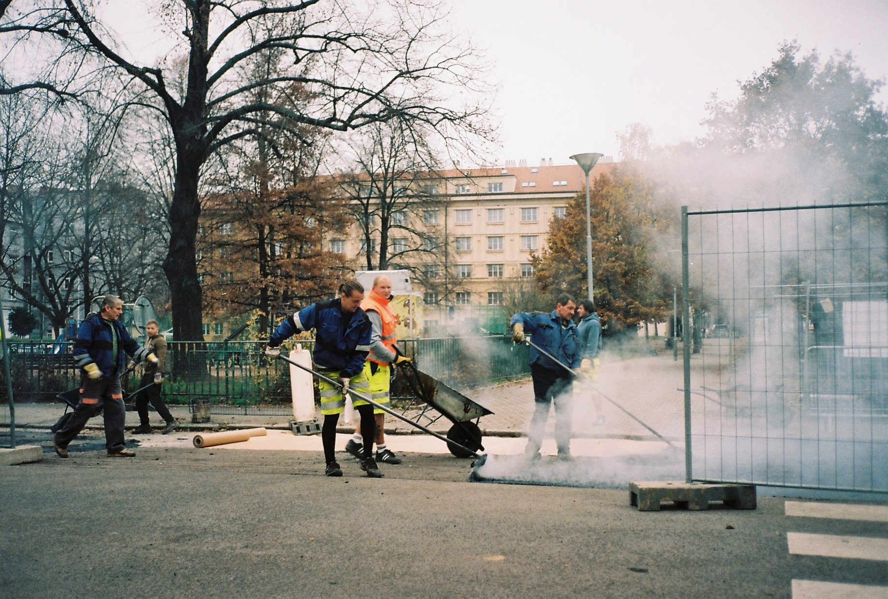
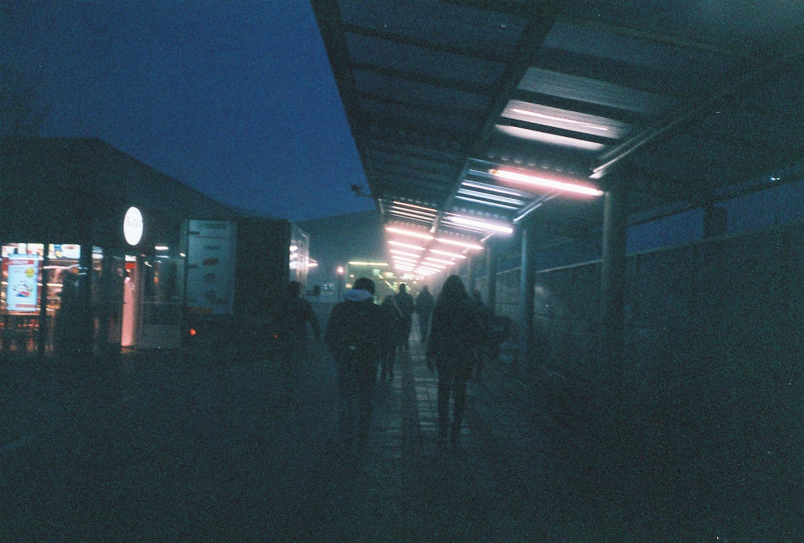

# 365 filmový projekt - Dokončenie

Ahoj, pamätáš sa ešte na môj filmový 365 projekt? Kde som plánoval každý deň fotit (práve) jednu fotku na film? Ak nie tak si o tom môžeš prečítať [tu](https://github.com/matopeto/fotimnafilm-articles/blob/08cebc414fc9238a65d14243ab5af6bdc047c3a2/365-project-cast-1-hodnotenie.md). Nezabudni sa tu ale potom vrátiť. Ak sa ti čítať nechce, tak v skratke som po pol roku projekt vzdal. S tým, že keby som ho robil znova, tak niektoré veci spravím inak. No ale rok po tom som sa to rozhodol zmeniť a projekt dokončiť.

## Výber fotoaparátu a filmov

Najväčší problém okrem rutiny som vtedy videl v tom, že som mal na to vyhradený celkom veľký fotoaparát - zrkadlovku Nikon FG-20. Na druhú polku som sa rozhodol využiť maličké **mjučko dvojku**, ktoré je síce plný automat ale na denné fotky určite bude stačiť. V chladničke som mal plno **expirovaných filmov**, tak som sa rozhodol, že celý polrok budem fotiť na ne. Začiatok som stanovil na 1.7.2019, teda presne na tú druhú polovicu roka ktorá mi chýbala (aj keď s dvoj ročným meškaním).

## Samotné fotenie

Ako prvý film som založil expirovaný (neviem presne kedy, ale bolo to viac ako 10 rokov) [Kodak Gold 200](https://fotimnafilm.sk/kodak-gold-200/), s ktoým som už predtým mal dobré skúsenosti. Keďže expirované filmy je dobre za každých 10 rokov preexponovať o 1 EV, využil som toho, že ak mjučko nevie prečítať DX kód nastaví ISO na 100. Nemusel som tak [DX kod hackovat](https://fotimnafilm.sk/ako-zmenit-dx-kod-na-kinofilme/) a stačilo DX kód na filme prelepiť. 

Začať v lete bolo určite lepšie ako začat na nový rok, kde bola tma a zima. V lete je všade veľa svetla dlho do večera, tak človek má a to odfotiť fotku oveľa viac času. Prvý film tak “utiekol” rýchlejšie ako cyklista na fotke :)

Druhý fim bol **Fuji Superia 200**, znova fotený ako ISO 100. Tu sa už trochu prejavovala spomenutá rutina, keďže som sa pohyboval stále po tých istých miestach, práca a doma. Zároveň som mal už v prvej polke projektu niektoré témy/miesta vyčerpané. Ale o tom to nie je. Tie isté miesta pod iným uhlom pohľadu poskytujú úplne iné zabery. _(Film mal iba 24 snímkov, ale keďže som prelepil DX kód, tak to mjučkok bralo ako 36 a dovolilo mi na neho nafotiť 26 snímkov, kým zistilo, že ďalej nemôže. Kiež by zbytočne nepretáčalo po 36 políčku)_

Tretie miesto v poradí si vylosoval **Happy Color 200**. A za svoj názov sa nemusí hanbiť. Z podania jeho farieb som bol fakt happy. Škoda, že to bol posledný môj kus.

Ako začala jeseň bolo nutné zvýšiť ISO, vybral som **Agfa Vista 400**, bohužiaľ si už nepamätám na aké ISO som ho fotil. Tipujem asi 200. Spolu s mlhavými ránami začali pribúdať aj dni, ktoré som zabudol (alebo sa mi nechcelo spraviť) fotku. Pociťoval som podobnú krízu ako v prvej polke. A ako si čítal v zhodnotení, myslel som, že by mohlo pomôcť vyvolanie exponovaných filmov. Nakoniec som sa tak nenamotivoval. Jednorázové prekvapenie na konci mi prišlo viac ako lokálna motivácia, ktorá by ma mohla možno aj demotivovať.

Do konca roka zostávalo cca 40 dní. Tak som vymyslel, ako posledné dva filmy zvolím 24 snímkový **Kodak 100** a “12+3” snímkový Agfacolor **HDC 200**. 

## Záver

Projekt skončil a ja som si hovoril, že by som mal (alebo chcel?) viac fotiť ľudí a niečo ako street. Bohužiaľ som z komfortného kruhu veľmi nevystúpil a ľudí fotil iba málo. Ale nevadí. S tým, že som to s dvojročnou pauzou dokončil som veľmi spokojný. Spokojnosť z dokončenia bola ale väčšia ako spokojnosť s fotkami.

Osobne by som sa do podobného projektu už nepustil. Výsledok bola totálna nechuť k foteniu, ktorá trvá až do dnes. Na druhú stranu mám rád rutiny a niečo podobného mi chýba. Medzitým som dal ešte jeden tematický 52 projekt na instax, ale po ňom som instax tiež rok nezobral do ruky :-/

**Čím bolo fotenie na mjučko iné ako na zrkadlovku?** Určite sa výber malého kompaktu osvedčil a mohol som brať so sebou aj iné, väčšie, filmové fotoaparáty, pokiaľ som chcel fotiť i niečo iné. Zmestil sa do malého vrecka a ani som nevnímal, že som ho musel "povinne" nosiť. Iný fotoaparát by som si na podobný projekt nevybral. Boli ale aj veci, ktoré ma na ňom hnevali.Najviac ma hneval vždy aktivovaný blesk po zapnutí fotáku a nutnosť ho vždy manuálne vypínať a ostrenie niekedy nezaostrilo tam kam som chcel. Preto bola nejaká časť fotiek rozmazaná. Ale aj napriek tomu bol na 365-ku optimálny.

To ako sa mi jednotlivé fotky podarili (bolo ich nakoniec 177) a čo všetko som odfotil si mohol vidieť na mojom analogovom instagrame [@matoanalogpeto](https://www.instagram.com/matoanalogpeto/).
