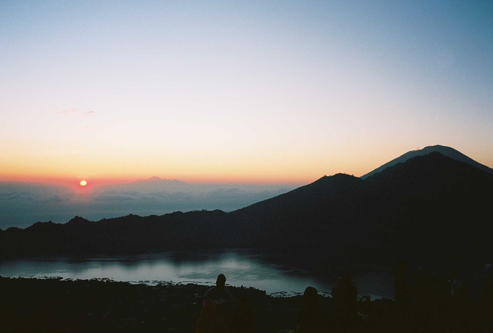
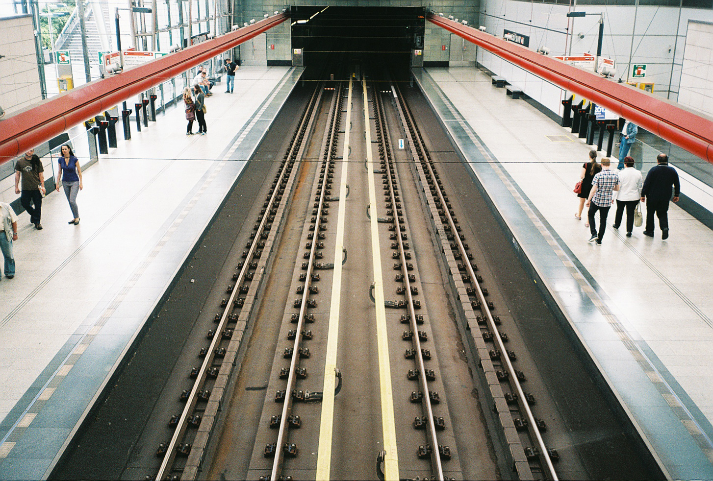
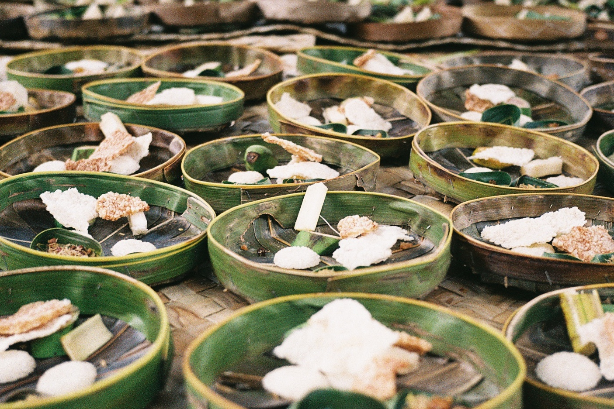
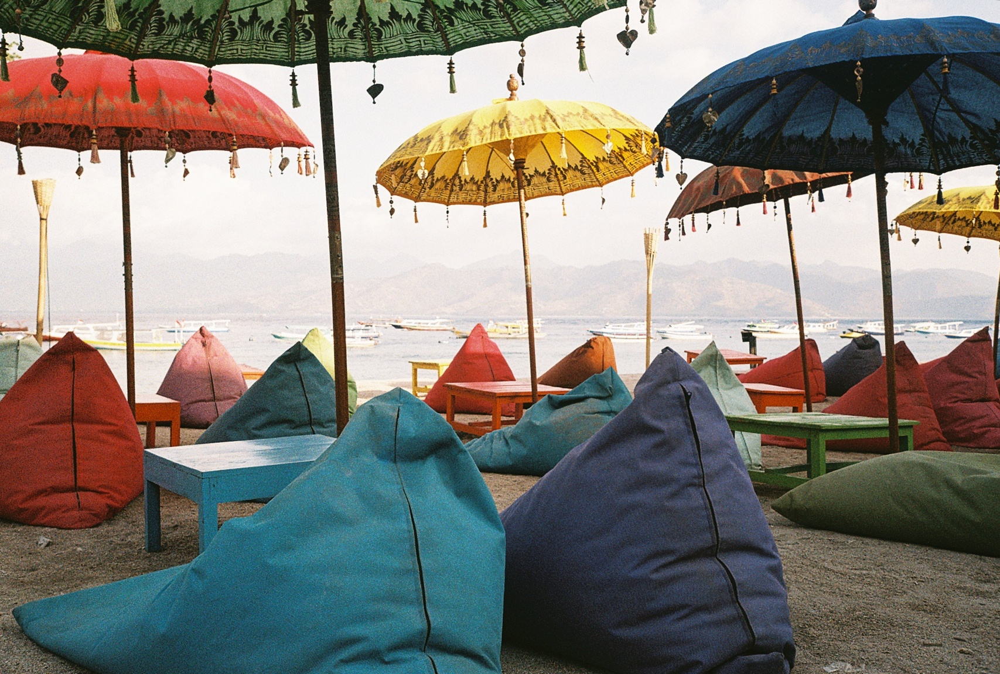
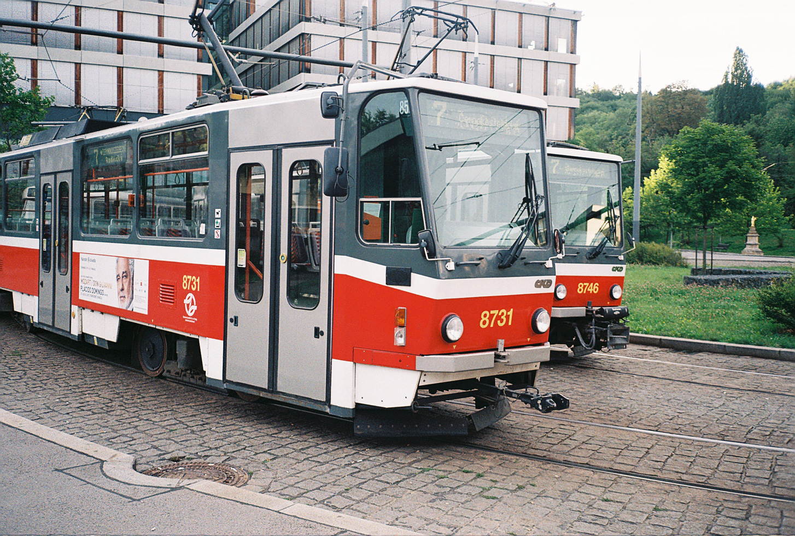
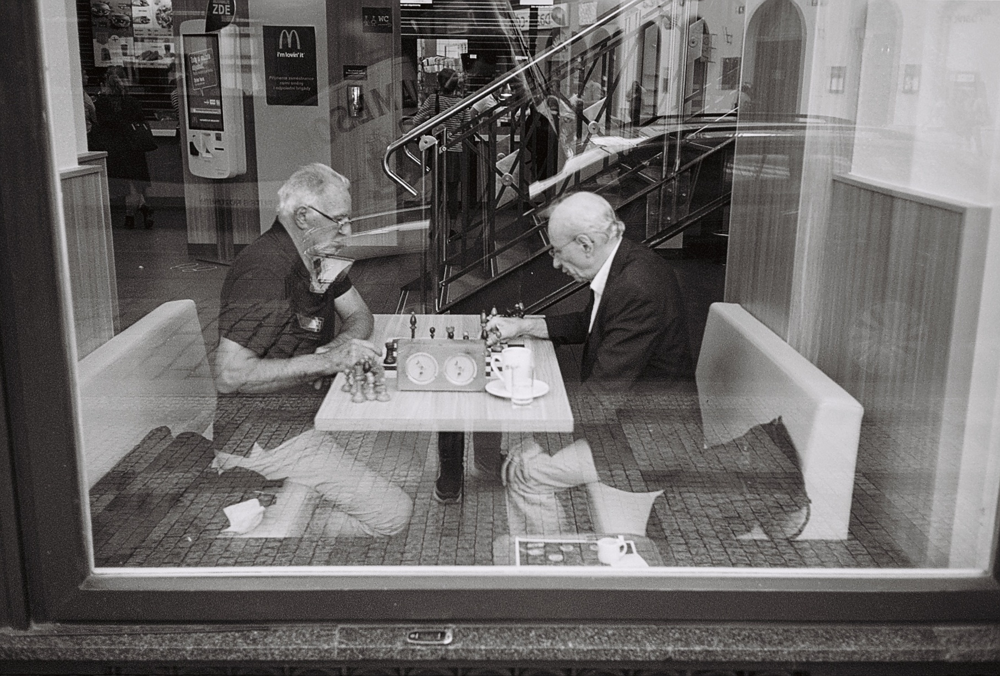

# Olympus µ[mju:] II

*(Článok pôvodne vyšiel na blogu [fotimnafilm.sk](https://fotimnafilm.sk))*

O tomto fotoaparáte počul už asi každý. Malý, automatický kompakt, ktorého cena stúpa tak rýchlo, ako cena masla pred Vianocami. Mňa osobne, nikdy tento typ automatických kompaktov nezaujímal. Fakt, že je automatický a nič si nemôžem nastaviť, a len tak fotiť mi príde také digitálne. A keďže na film fotím z veľkej časti aj pre moju vášeň k starým manuálnym foťákom, na ktorých sú všetky tie nastavovacie a naťahovacie mechanizmy, ktoré mám tak rád, Olympus Mju II som považoval za foťák „nie pre mňa“.

## Nikdy nehovor nikdy

Jedného dňa na mňa vyskočila ponuka, ktorá sa nedala odmietnuť. Strieborné Mju II za cenu jedného kinofilmu. A o pár dní na to, čierne Mju II za cenu troch lepších kinofilmov. Tak som ich vzal, veď za vyskúšanie človek nič nedá. Poviem vám na rovinu…od prvého momentu som si tento model zamiloval. Mjučkami som odvtedy odfotil asi 6 filmov a zobral som ho dokonca aj ako hlavný fotoaparát na dovolenku na Bali. A teraz by som sa chcel s vami podeliť o skúsenosti s nimi, dvoma mjučkami.

## Moje Olympus Mju II

Prvé mju, ktoré som získal bola strieborná QD verzia, nie až v tak dobrom stave. Kryt baterie bol prilepený lepiacou páskou a tlačidlo spúšte malo iba jednu pozíciu – bez medzistlačenia na predostrenie. Ak chcel človek predostriť, musel tlačítko spúšte stlačit veľmi jemne inak to rovno cvaklo. Vtedy som si však myslel, že je to vlastnosť, ktorú má Mju normálne, a tak som sa s tým proste naučil fotiť. QD znamená, že je to verzia s dátumovačom, ktorý do fotky vypaľuje dátum. Musím povedať, že som ho za celý film zabudol zapnúť a tak vôbec netuším ako a či funguje. Druhé Mju, v čiernej verzii je v mint stave.

Na testovanie som do strieborného založil farebný film – konkrétne FujiColor C200,  do čierneho monochromatický film Ilford XP2 400 a vyrazil som fotiť.

## Ovládanie a vlastnosti

Ovládanie je jednoduché. Otvorený kryt=zapnutý, zatvorený kryt=vypnutý. „Namačknutím“ spúšte zaostrí a odmeria expozíciu, „domačknutím“ spúšte odfotí. To je všetko. Vzadu sú ešte dve tlačítka. Prvé je na nastavenie, resp. vypnutie blesku. Druhé na nastavenie samospúšte. Keď sa stlačia obe naraz, je možné meranie expozície prepnúť na bodové. Tlačítka sú maličké a zapustené do tela aparátu, a preto ich stláčanie je skoro ako za trest. A trest je to ozaj veľký, hlavne ak máte, tak ako ja, radi fotenie bez blesku. Po každom zapnutí foťáku je blesk znova zapnutý na automatike, takže je ho potrebné stále dookola vypínať. Na druhej strane musím povedať, že automatický blesk je celkom inteligentný, a zapína sa fakt iba keď treba. Dokáže dokonca detekovať protisvetlo a tak objekt v ňom prisvetliť. Posledné sklamanie prišlo po odfotení 36. fotky. Takto maličké telo by normálne na jeden film dokázalo odfotiť aj 40 fotiek. Automatika je ale automatika, a po 36, sa začne automatické navíjanie filmu nazad do kazety.

Výsledky ma milo prekvapili. Nie len to, že boli krásne ostré – autofocusu som veril najmenej, ale i správne exponované a kontrastné. Však posúďte sami.

Viac fotiek (nie len z mjučok) nájdete [na mojom “analógovom” Instagrame](https://instagram.com/matoanalogpeto).

Na fotkách sa ukázala ďalšia z chýb strieborného kusu a to malý lightleak v spodnej časti fotky. Svetlo vniká cez medzeru medzi telom a objektívom. Žiaľ, podľa iných majiteľov Olympus Mju II, ide o bežnú vadu. Na čiernom kuse sa táto vada zatiaľ (našťastie) neprejavila.

I keď sa jedná o úplne automatický foťák, našiel si svoje miesto vo vrecku mojej bundy a nosím ho každý deň so sebou. Keby som ho mal pred začatím svojho [365 projektu](./365-project-cast-2-hodnotenie.md), možno by som vydržal dlhšie ako pol roka. Ale o tom niekedy inokedy.

## Záver

Čo dodať na záver?

Plusy Olympus Mju II: Určite jeho veľkosť – maličký a nenápadný. I keď ide o malý fotoaparát fotí kvalitne – ostré a kontrastné fotky. Ďalej presný autofocus, je rýchly a blesk je inteligentný.

Mínusy: Blesk je stále (po zapnutí fotoaparátu) zapnutý na automatike. Hlasné pretáčanie filmu po každej fotke. Žiadna indikácia (dlhého) zvoleného času. Autofocus zvykne mať problém zaostriť sklenené predmety (napr. poháre). Odfotí iba 36 fotiek. Uplná automatika (toto je možno pre niekoho plus) Light Leaks (čo je vraj bežná vada).
